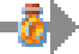
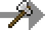

---
navigation:
  title: Cheese Processing
  icon: "vintagetech:fresh_cheese"
  parent: misc.md
categories:
  - misc
item_ids:
  - vintagetech:sealed_cheese
  - vintagetech:aged_cheese
  - vintagetech:fresh_cheese
  - vintagetech:matured_cheese
  - vintagetech:aged_cheese_slice
  - vintagetech:fresh_cheese_slice
  - vintagetech:matured_cheese_slice
position: 3
---

# Cheese Processing

A new unique type of food that can be sealed and will age over time based on some conditions

# Fresh Cheese

As first thing , you need to get some <ItemLink id="vintagetech:fresh_cheese"/>

When placed and right clicked/broken it will return some slices (same thing for all of the cheeses)

<Row>
<ItemImage id="vintagetech:fresh_cheese"/>

<ItemImage id="vintagetech:fresh_cheese_slice" />
</Row>

<Row>
<ItemImage id="vintagetech:matured_cheese"/>

<ItemImage id="vintagetech:matured_cheese_slice" />
</Row>

<Row>
<ItemImage id="vintagetech:aged_cheese"/>

<ItemImage id="vintagetech:aged_cheese_slice" />
</Row>

You can place one cheese over another cheese to reach 8 pieces on the same block

<GameScene zoom="2" interactive={true}>
  <Block z="0" x="0" id="vintagetech:fresh_cheese" p:pieces="4" />
  <Block z="0" x="1" id="vintagetech:fresh_cheese" p:pieces="3" />
  <Block z="0" x="2" id="vintagetech:fresh_cheese" p:pieces="2" />
  <Block z="0" x="3" id="vintagetech:fresh_cheese" p:pieces="1" />

  <Block z="1" x="0" id="vintagetech:fresh_cheese" p:pieces="5" />
  <Block z="1" x="1" id="vintagetech:fresh_cheese" p:pieces="6" />
  <Block z="1" x="2" id="vintagetech:fresh_cheese" p:pieces="7" />
  <Block z="1" x="3" id="vintagetech:fresh_cheese" p:pieces="8" />
  
</GameScene>

# Aging Cheese

To create a <ItemLink id="vintagetech:matured_cheese"/> or an <ItemLink id="vintagetech:aged_cheese"/> you need to seal into a <ItemLink id="vintagetech:sealed_cheese"/> , to make that you need to use an <ItemLink id="cakesticklib:honey_solution"/> over a placed <ItemLink id="vintagetech:fresh_cheese"/> or a <ItemLink id="vintagetech:matured_cheese"/> and satisfy all of the requirements

<Row>
<ItemImage id="vintagetech:matured_cheese"/>
<ItemImage id="vintagetech:fresh_cheese"/>

<ItemImage id="vintagetech:sealed_cheese" />
</Row>

<GameScene zoom="2" interactive={true}>
  <Block z="0" x="3" id="vintagetech:fresh_cheese" p:pieces="4" />
  <Block z="0" x="2" id="vintagetech:sealed_cheese" p:pieces="4" />
  <Block z="0" x="1" id="vintagetech:matured_cheese" p:pieces="4" />
  <Block z="0" x="0" id="vintagetech:aged_cheese" p:pieces="4" />

  <Block z="1" x="3" id="vintagetech:fresh_cheese" p:pieces="8" />
  <Block z="1" x="2" id="vintagetech:sealed_cheese" p:pieces="8" />
  <Block z="1" x="1" id="vintagetech:matured_cheese" p:pieces="8" />
  <Block z="1" x="0" id="vintagetech:aged_cheese" p:pieces="8" />
</GameScene>

## Conditions and boosts

- Require to stay at a light level below 5
- Require to not see the sky
- (Optional) Age fast when placed over wooden blocks
- (Optional) Age fast when it doesn't have any piece cut out

## Unsealing

After wait some time , you can unseal it to see the final form using an Axe

<Row>
<ItemImage id="vintagetech:sealed_cheese"/>

<ItemImage id="vintagetech:matured_cheese" />
<ItemImage id="vintagetech:aged_cheese" />
</Row>

Note : **Age** define the result cheese so if you unseal it before it's aged , it will return a <ItemLink id="vintagetech:fresh_cheese"/>
